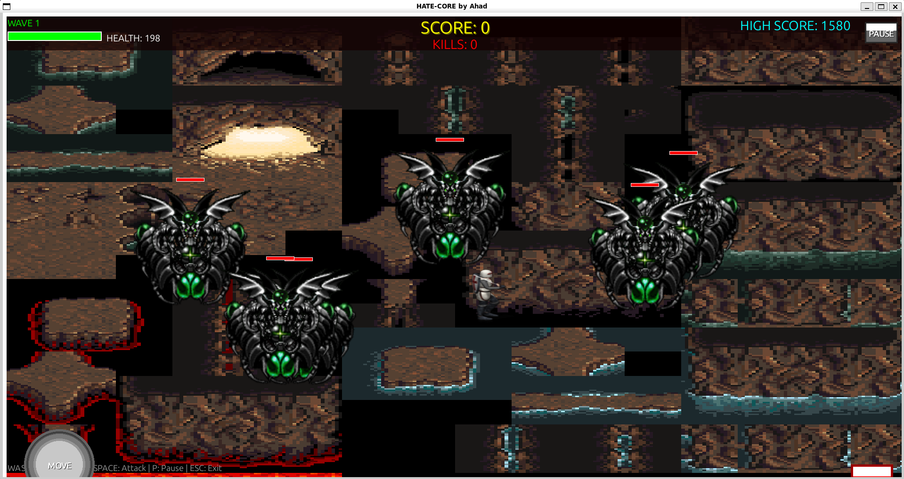

# Hate-Core

---

**Hate-Core** is my first serious Python game, inspired by Dark Souls. You control a lone knight in a 2D world, fighting dragons, surviving as long as possible, and trying to beat your high score. I built this as a learning project with **Pygame**, experimenting with sprites, music, and simple game mechanics. Still a beginner, so there’s a lot to improve!

---

## Features

* 2D hack-and-slash combat
* Sprites and animations for characters and dragon
* Background music and sound effects
* Keyboard and touch controls
* High-score system

---

## Screenshot

<p align="center">
  
</p>

---

## Controls

* **Arrow keys / WASD** → Move knight
* **Space / Enter** → Attack
* **R → Restart**
* *(Touch controls if using a touchscreen device)*

---

## Getting Started

### Prerequisites

* Python 3.x
* Pygame (`pip install -r requirements.txt`)

### Run the Game

```bash
# Clone the repository
git clone https://github.com/ah4ddd/Hate-Core

# Navigate into the folder
cd Hate-Core

# Install dependencies
pip install -r requirements.txt

# Start the game
python3 main.py
```

---

## Notes

* This is a Phase 1 project, so mechanics are simple.
* I’d love feedback, tips, or suggestions for improvement!

---

## Future Improvements

* Add more enemies and boss mechanics
* More complex attacks and animations
* Score leaderboard and better UI
* Polish graphics and music
* And actual lore to it

---

**Made by**
[Ahad](https://github.com/ah4ddd)

**Feel free to contribute**
[Hate-Core](https://github.com/ah4ddd/Hate-Core)
